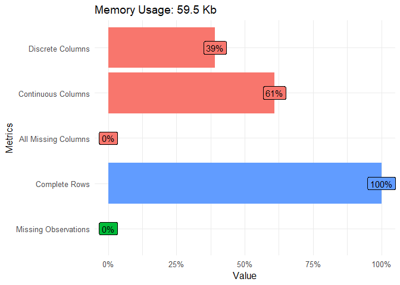
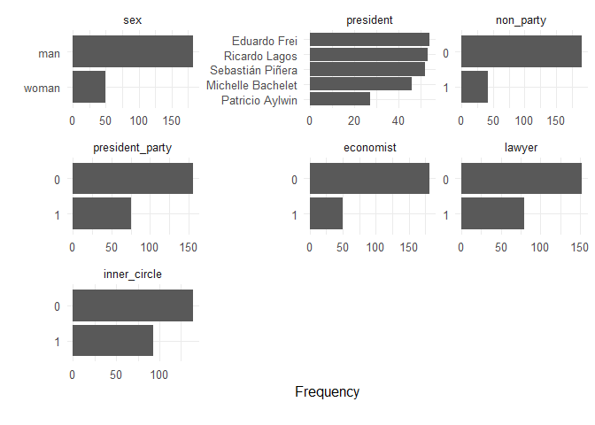
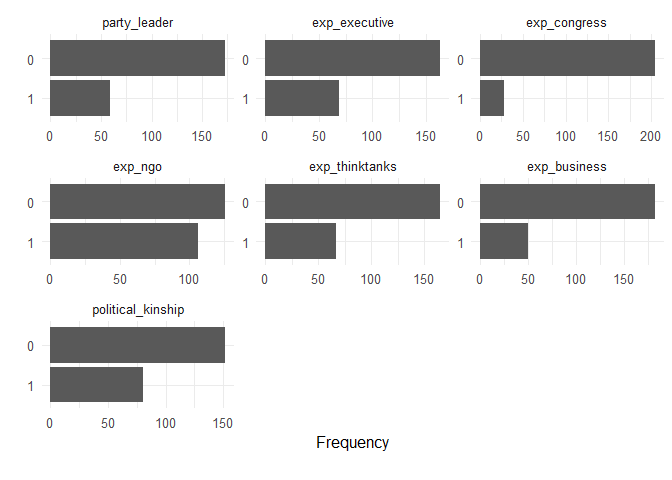
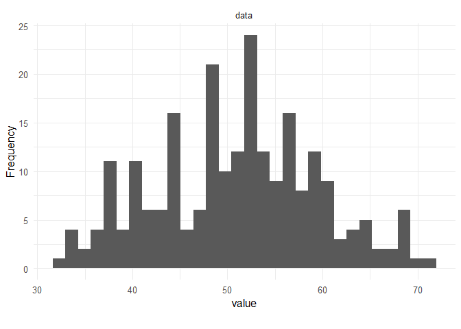
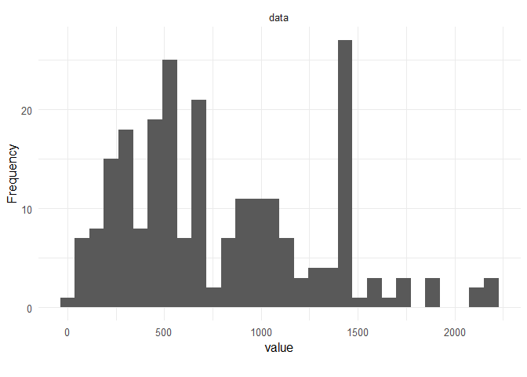

Exploratory Data Analysis
================

## Packages and Data

``` r
## Packages
library(DataExplorer)
library(ggplot2)

## Data
data_CHL <- read.csv("../data/tidy/Chilean_cabinets_1990_2014.csv", encoding = "UTF-8")
```

## Data Set Plot

``` r
plot_intro(data_CHL, ggtheme = theme_minimal(base_size = 12),
           theme_config = theme(legend.position = "none")) 
```

<!-- -->

## Discrete Variables

``` r
selection_var1 <- drop_columns(data_CHL, c("id", "country", "name", "start_president", "end_president",
                                           "ministry", "start_minister", "end_minister", "party_leader",
                                           "exp_executive", "exp_congress", "exp_ngo", "exp_thinktanks",
                                           "exp_business", "political_kinship"))
selection_var2 <- drop_columns(data_CHL, c("id", "country", "name", "start_president", "end_president",
                                           "ministry", "start_minister", "end_minister", "sex",
                                           "president", "non_party", "president_party", "economist",
                                           "lawyer", "inner_circle"))
plot_bar(selection_var1, ggtheme = theme_minimal(base_size = 12))
```

<!-- -->

``` r
plot_bar(selection_var2, ggtheme = theme_minimal(base_size = 12))
```

<!-- -->

## Age Variable

``` r
plot_histogram(data_CHL$age, ggtheme = theme_minimal(base_size = 12))
```

<!-- -->

## Time Variable

``` r
data_CHL$time <- with(data_CHL, (as.Date(data_CHL$end_minister) - as.Date(data_CHL$start_minister)))
data_CHL$time <- as.numeric(data_CHL$time)
plot_histogram(data_CHL$time, ggtheme = theme_minimal(base_size = 12))
```

<!-- -->
